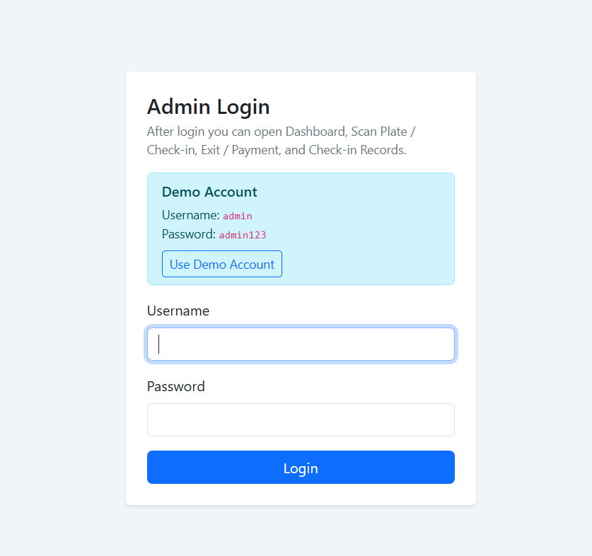
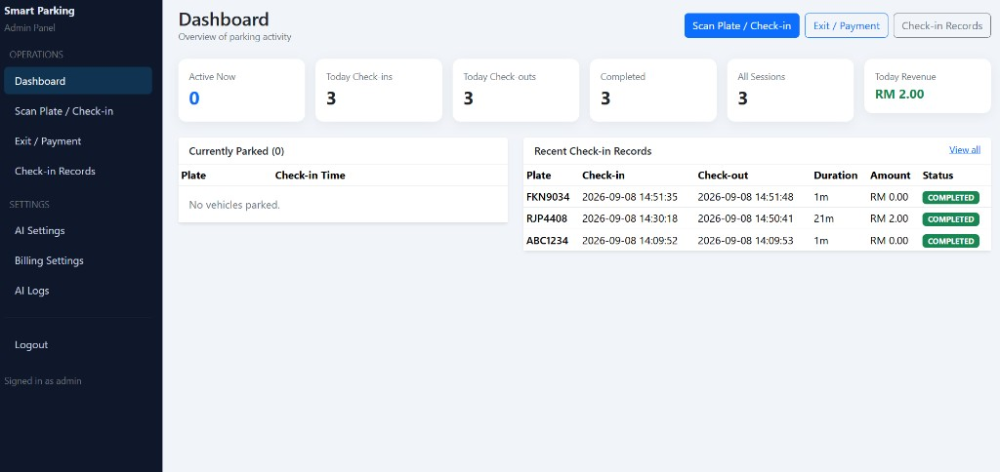
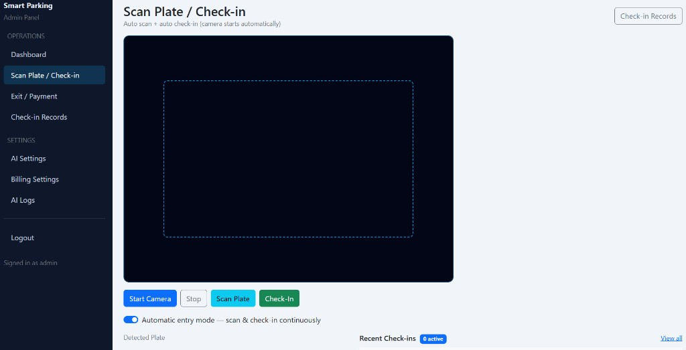
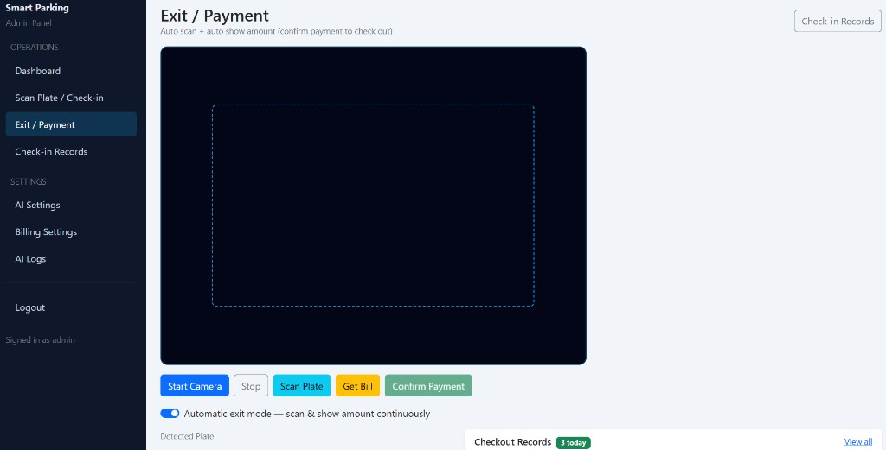
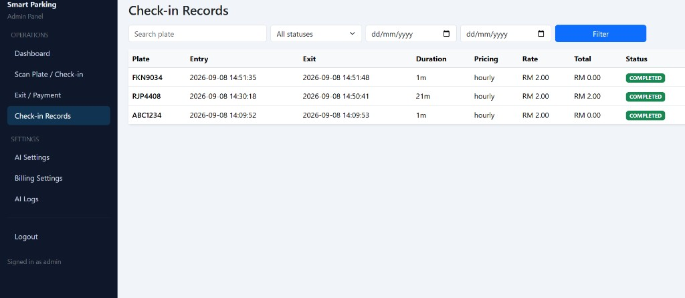
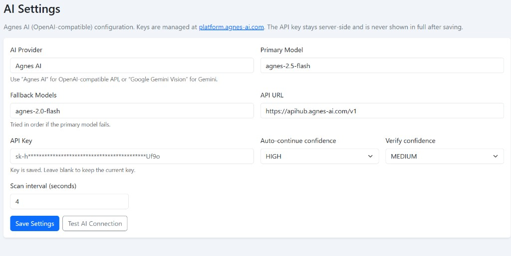
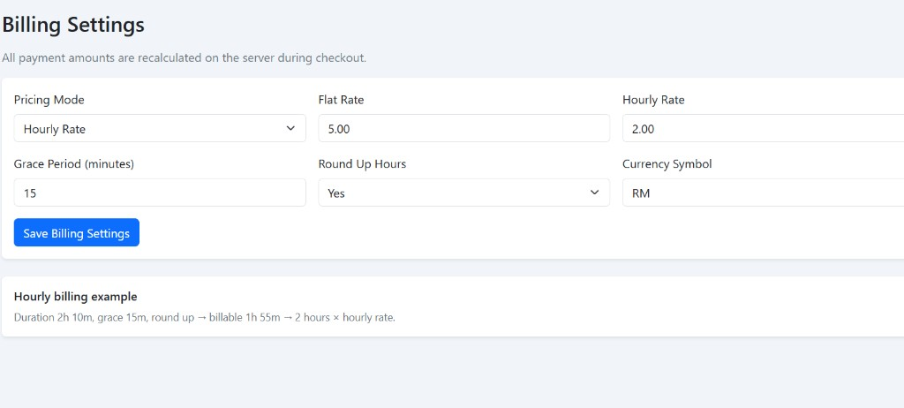
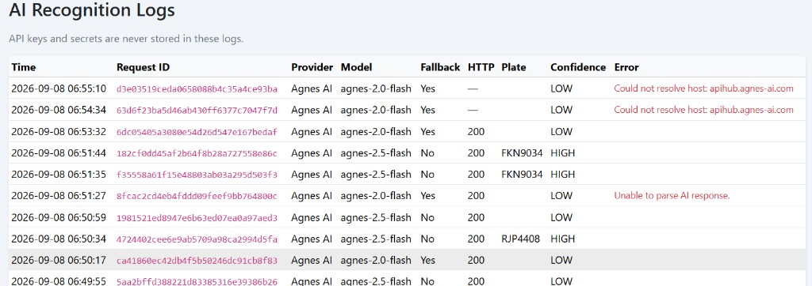

# Smart Parking Management System

Admin-only web app for AI license-plate parking entry, exit billing, and records.

## Features

- Admin login (session + CSRF)
- Dashboard (active vehicles, today stats, revenue)
- Scan Plate / Check-in (camera + Agnes AI, auto mode)
- Exit / Payment (auto scan, show amount, confirm checkout)
- Check-in / checkout records (search + filters)
- AI Settings (Agnes OpenAI-compatible) + connection test
- Billing Settings (flat / hourly, grace period, round-up)
- AI recognition logs (no API keys stored in logs)
- SQLite zero-config database (auto-created)

## Requirements

- PHP 8.2+ with PDO SQLite and cURL
- Modern browser with camera permission (HTTPS or localhost)

## Quick start (XAMPP)

1. Copy this folder to `htdocs`
2. Start Apache (or run PHP built-in server)
3. Open: `http://localhost/number_plate_scanner_system/admin/login.php`
4. Demo account:
   - Username: `admin`
   - Password: `admin123`
5. Go to **AI Settings**, paste your Agnes API key from [platform.agnes-ai.com](https://platform.agnes-ai.com/settings/apiKeys), then **Test AI Connection**

### PHP built-in server (optional)

```bash
php -S 127.0.0.1:8088 -t .
```

Then open `http://127.0.0.1:8088/admin/login.php`

## Project structure

```text
admin/          # Dashboard, entry, exit, records, settings
api/            # JSON APIs (check-in, checkout, recognize, settings)
config/         # bootstrap, auth, helpers, database
assets/         # CSS / JS
data/           # SQLite DB (gitignored)
logs/           # App logs (gitignored)
```

## Security notes

- Do **not** commit real API keys or `data/*.sqlite`
- API keys are stored server-side in settings and never returned in full to the browser
- Change the demo admin password for production
- Prefer HTTPS in production (camera requires secure context)

## Screenshots

















## License

MIT
